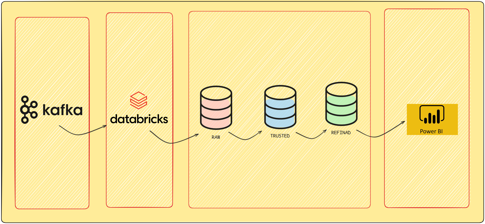
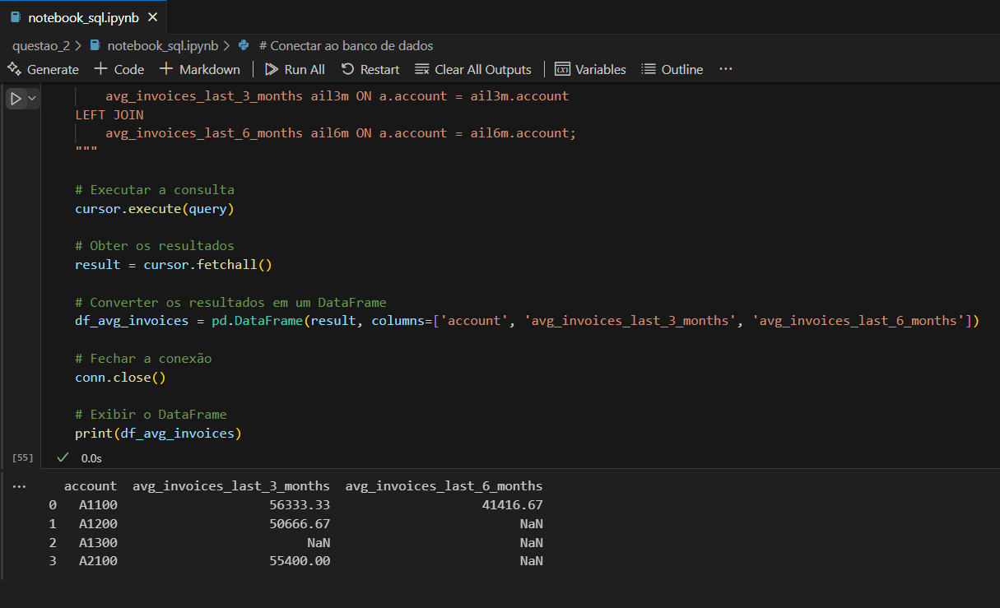
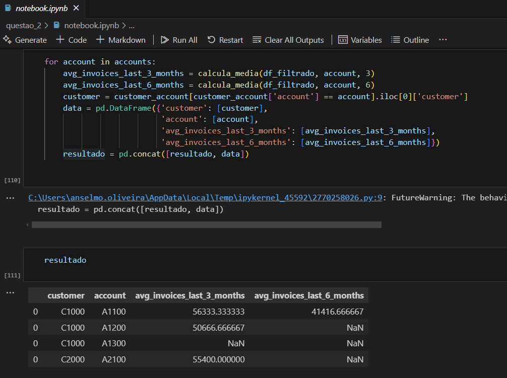
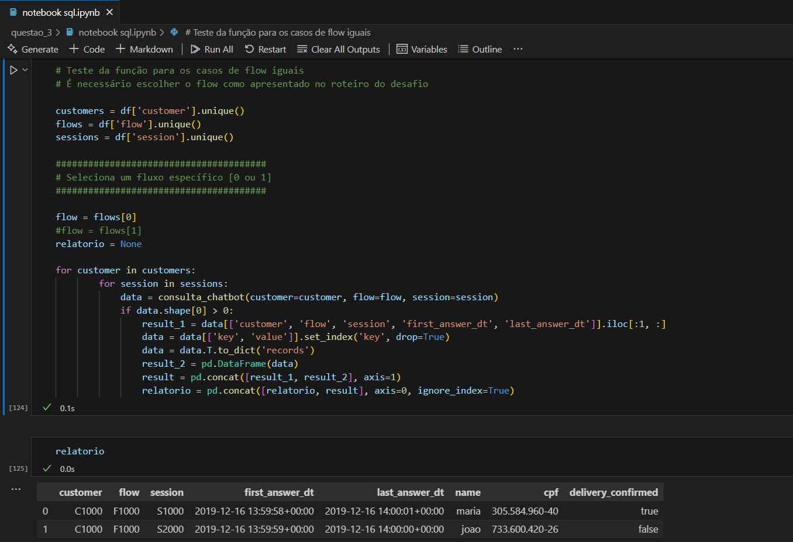
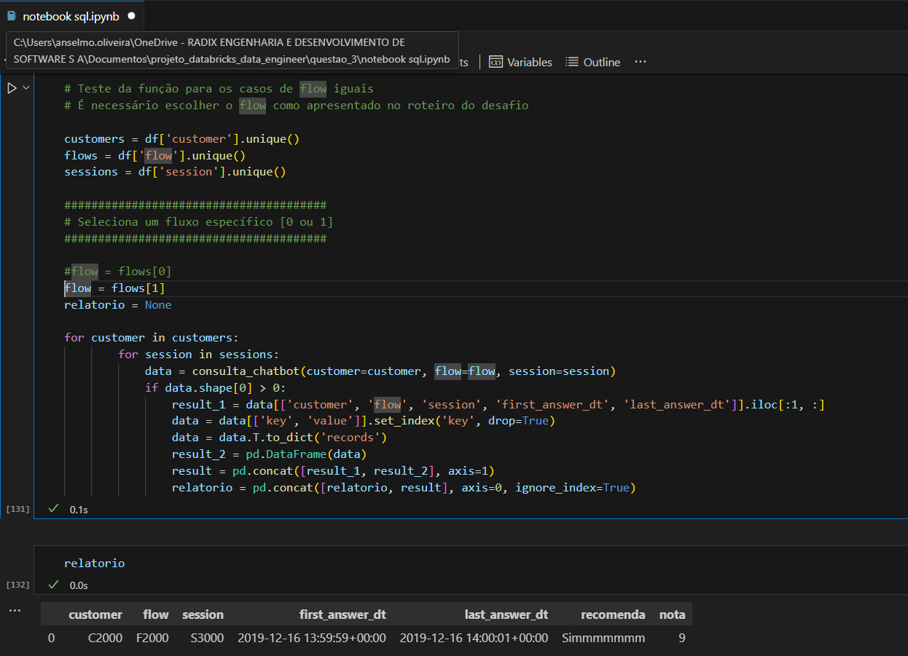

# Desafio Engenheiro de Dados

##### Autor: Anselmo Oliveira
##### Data: 14/11/2024
##### Desafio: Desenvolver Arquitetura de Dados

# Questão 1

<cite>Projete uma solução para uma plataforma de comunicação que computa a utilização de notificações Whatsapp de milhares de clientes a cada minuto.</cite>

<cite>Projete uma solução para uma plataforma de comunicação que computa a utilização de notificações Whatsapp de milhares de clientes a cada minuto.</cite>

<cite>A interface gráfica é um painel simples, apresentando alguns dados conforme o exemplo abaixo:</cite>

##### Painel de Notificações
Cliente: Acme
Notificações Whatsapp: 5000
Última atualização: 2020-02-03T15:00:00+00:00

As notificações são processadas a cada minuto e podem ser exportadas em um relatório detalhado conforme exemplo abaixo:

##### Relatório Detalhado de Notificações
= Cliente: Acme =
Mensagem ID: 5B81FF24A1
Payload: “Olá XXXXX, seja muito bem-vindo! Precisa de alguma ajuda?”
Data hora: 2020-02-03T14:00:01.001+00:00
...
Mensagem ID: A61D178E73
Payload: “Não identificamos a sua última mensagem. Por favor, entre em contato”
Data hora: 2020-02-03T14:00:01.099+00:00
...

<cite>Além disso, a solução também deve possibilitar a geração de um relatório de cobrança uma vez por dia, conforme exemplo abaixo:</cite>

Relatório de Cobrança
Cliente: Acme
Notificações Whatsapp: 25000
Valor: R$ 1000,00
Data: 2020-02-03

<cite>A origem dos dados é um tópico no Kafka, com um volume de 100 milhões de mensagens/dia, com o seguinte payload:</cite>

| customer_id | message_id | customer_name | channel  | payload                                   | event_datetime               |
|-------------|------------|---------------|----------|------------------------------------------|------------------------------|
| 7494212     | 5B81FF24A1 | Acme          | Whatsapp | Olá XXXXX, seja muito bem-vindo! Precis...| 2020-02-03T14:00:01.001+00:00 |
| 7494212     | A61D178E73 | Acme          | Whatsapp | Não identificamos a sua última mensagem...| 2020-02-03T14:00:01.099+00:00 |

<cite>Proponha uma arquitetura que contemple cada um dos casos de uso: painel de notificação, relatório detalhado de notificações e relatório de cobrança.</cite>

##### Inicio da resposta

##### Ingestão de Dados com Apache Kafka

Podemos utilizar o Kafka para realizar a ingestão de dados em tempo real, permitindo processamento de alta escala e baixa latência.

##### Processamento em Tempo Real com Databricks e Apache Spark

O Databricks pode ser utilizado para processar os dados do Kafka utilizando o Databricks Structured Streaming que implementa os recursos do Apache Spark. Os dados ingeridos serão armazenados no Delta Lake, com janela de agregação de 1 minuto.

##### Armazenamento e Consultas com Delta Lake

O Delta Lake do Databkicks será implementado com uma arquitetura de camadas: Bronze, Prata e Ouro. Os dados ingeridos pelo Databricks serão carregado as-is diretamente na camada Bronze.
As camadas seguintes, Prata e Ouro serão responsáveis por realizar o processamento, limpeza para criação do data Mart com as informações refinadas para os relatórios.

##### Visualização e Relatórios

A criação dos relatórios irá consumir as tabelas com os cálculos refinados dos relatórios detalhados de notificação e Cobrança, que poderá ser realizada por ferramentas como Power BI, Metabase, Superset entre outros.

##### O resultado final o fluxo seguiria da seguinte forma

Figura 1 - Fluxograma das ferramentas

##### Informações importantes

- O tópico do Kafka possui capacidade de suportar milhões de mensagens por dia;
- Possui capacidade de escalabilidade horizontal para garantir a performance;
- Os dados serão transmitidos pelas camadas em tempo real de maneira rápida e eficiente.
- O Spark poderá ser utilizado para ser uma das ferramentas de análises exploratória e visualização dos dados.

# Questão 2:
 
 <cite>Com base no arquivo invoices.csv, escreva um serviço que computa a média de faturamento de cada conta (account) nos últimos três e seis meses retroativos à Jan/2020. Quando não há dados suficientes na janela de 3 ou 6 meses o serviço registra a entrada como null.</cite>

<cite>Resultado esperado:</cite>

| customer | account | avg_invoices_last_3_months | avg_invoices_last_6_months |
|----------|---------|----------------------------|----------------------------|
| C1000    | A1100   | 56.333,33                  | 41.416,66                  |
| C1000    | A1200   | 50.666,66                  | null                       |
| C1000    | A1300   | null                       | null                       |
| C2000    | A2100   | 55.400,00                  | null                       |

##### Inicio da resposta

Foi criado dois scripts (Python e SQL) para realizar o calculo das faturas retroativas com as regras de negocio apresentadas

Figura 2 - Saída do programa SQL

Figura 3 - Saída do programa Python

Passo a passo da solução:

- Filtrar os registros para para listar apenas os registros antes de 2020-01-01
- Salvar os dados no banco de dados (para a solução SQL)
- Contar quantos registros existem entre a data de referência, a data de referência - 3 meses, e a data de referência - 6 meses.
- Atribuir nulo para as os registros que não atingirem a quantidade mínima e calcular a média para os dados com a quantidade minima.
- Construir um novo dataframe para armazenar os dados com customer e account e médias.

##### Questão 3:

<cite>Uma plataforma de comunicação fornece fluxos de conversação (chatbots) entre outras funcionalidades. O data lake desta plataforma armazena valores informados pelos usuários em um formato semiestruturado (JSON) particionado por hora:</cite>

●	hour=13.json
●	hour=14.json

<cite>Considere que a seção content mantém as respostas de usuários. Ou seja, os valores preenchidos pelos usuários durante uma conversa. Para isto, ela armazena mapas onde a chave e valor são do tipo String.</cite>

<cite>Implemente um serviço que gera um relatório consolidado das últimas respostas informadas pelos usuários na hora 13 e hora 14 no seguinte formato:</cite>

| customer | flow  | session | first_answer_dt     | last_answer_dt      | name  | cpf            | delivery_confirmed |
|----------|-------|---------|---------------------|---------------------|-------|----------------|--------------------|
| C1000    | F1000 | S1000   | 2019-12-16T13:59:58 | 2019-12-16T14:00:01 | maria | 305.584.960-40 | true               |
| C1000    | F1000 | S2000   | 2019-12-16T13:59:59 | 2019-12-16T14:00:00 | joao  | 733.600.420-26 | false              |

<cite>Os campos first_answer_dt e last_answer_dt representam, respectivamente, a primeira e última interações válidas (diferente de vazio). No exemplo acima, os campos name, cpf e delivery_confirmed são as respostas do usuário.</cite>

<cite>Para concluir, o serviço deve ser agnóstico de conversa, ou seja, deve suportar conteúdo de qualquer fluxo. Exemplo:</cite>

| customer | flow  | session | first_answer_dt     | last_answer_dt      | recomenda  | nota |
|----------|-------|---------|---------------------|---------------------|------------|------|
| C2000    | F2000 | S3000   | 2019-12-16T13:59:59 | 2019-12-16T14:00:01 | Simmmmmmm  | 9    |

<cite>Neste exemplo, recomenda e nota são as respostas do usuário.</cite>

##### Inicio da resposta

Foi criado o script Python e SQL para realizar o calculo das conversas do chatbot com as regras apresentadas.

Passo a passo da solução:

- Fazer a leitura dos dados e fazer a ingesão no banco de dados.
- utilizar a "ROW_NUMBER" para selecionar a ultima mensagem valída do do customer, flow e session.
- Remover os resultros nulos e strings vazias.
- Fazer uma subquery para selecionar a data de incio e fim da conversa para os mesmos customer, flow e session.
- Concatenar e ter a tabela final no formato desejado.
- Processar cada flow individualmente, pois cada um possui uma estrutura de tabela diferente.
- Acessar cada combinação possível de customer, flow, e session para obter todas as conversas.
- Efetuar a leitura das colunas customer, flow e session, first_answer_dt e last_answer_dt que serão iguais devido ao filtro por conversa, obtendo apenas a primeira linha.
- Transpor os registros de key e value, ordenados pela data de envio.
- Concatenar os dados e compor a tabela de saida como apresentada no desafio.

As evidências com a saída solicitada segue abaixo.

Figura 4 - Saída do programa SQL

Figura 5 - Saída do programa Python